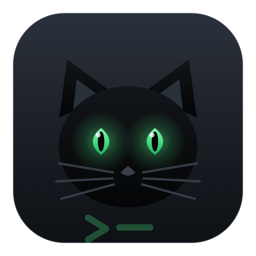
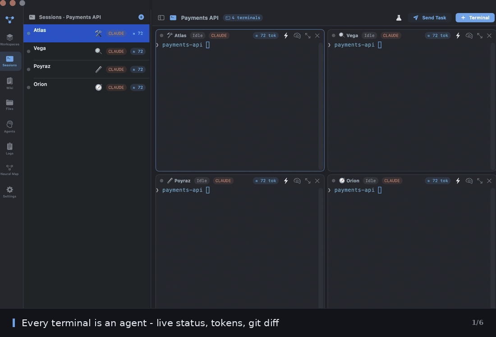
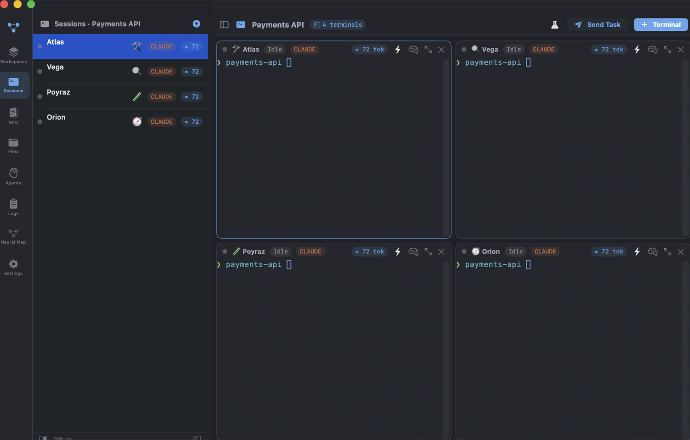
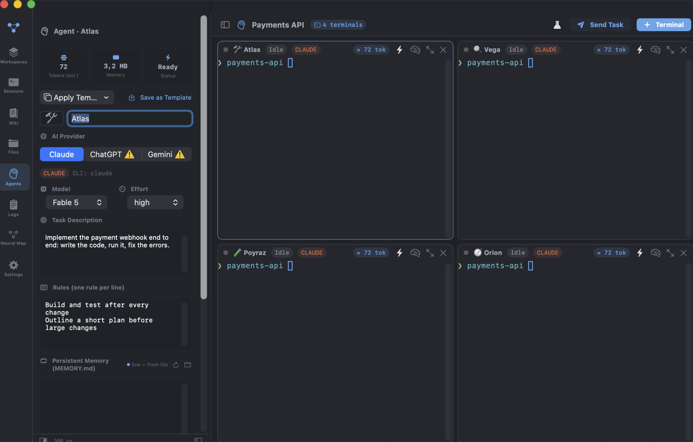
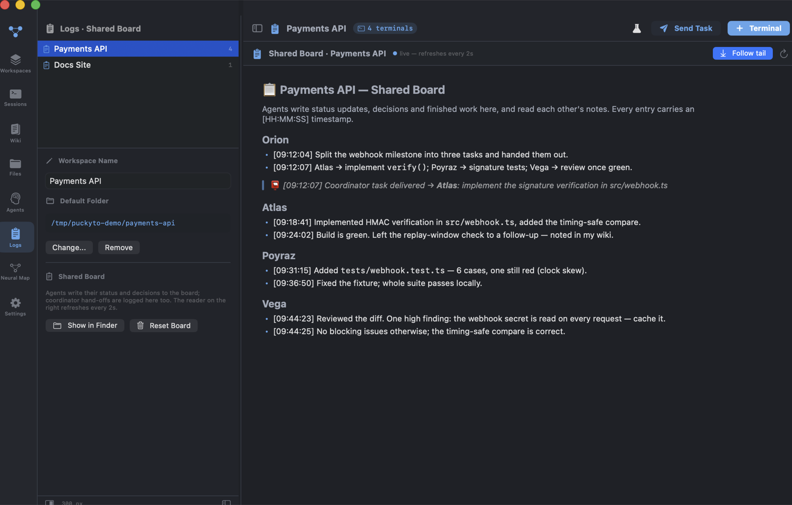
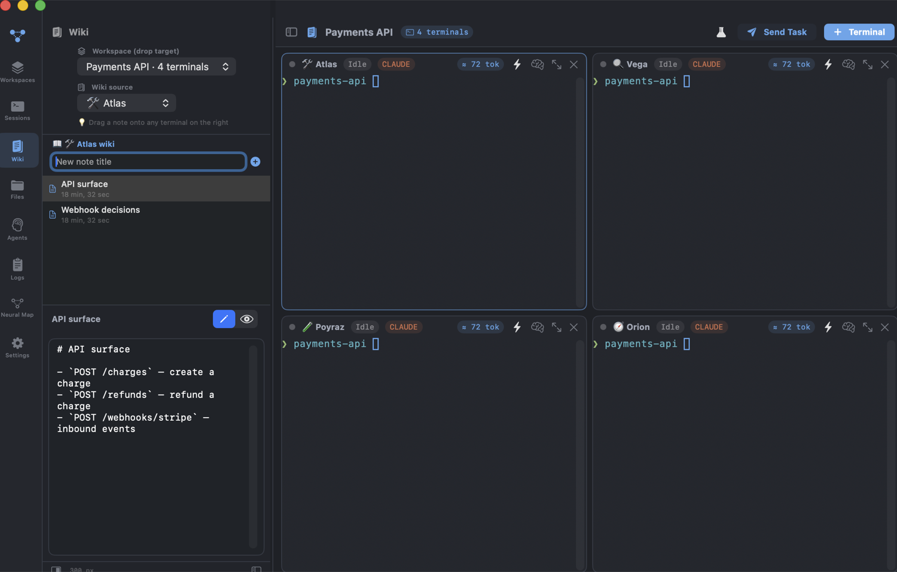
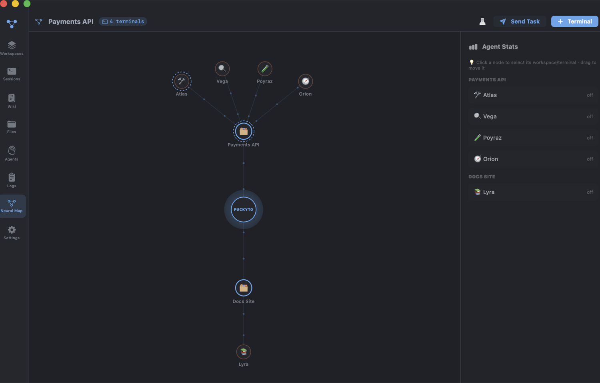
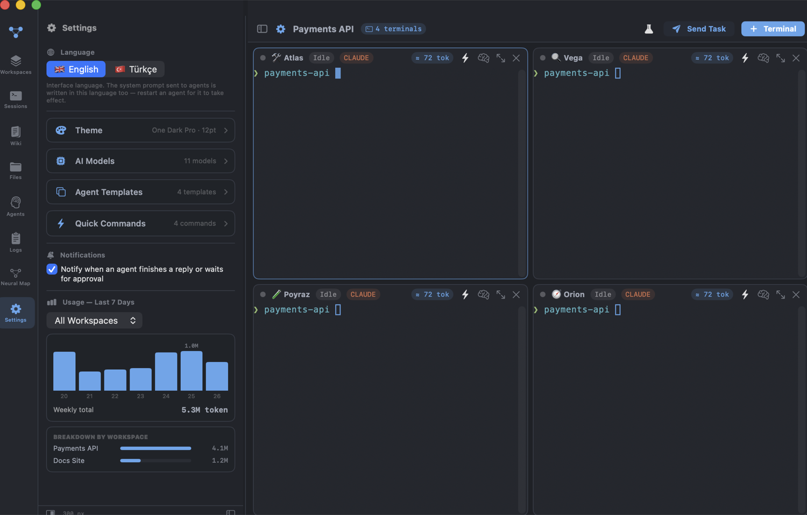

# Puckyto

**A mission control for your AI coding agents.**



Puckyto is a native macOS app that runs several terminals side by side and treats the AI agent inside
each one (Claude / ChatGPT / Gemini) as a first-class citizen: it has a name, a task, a rule set and a
memory that survives restarts. Around them sit the things you actually need when three agents are
working at once — a shared board they write to, a task queue that feeds them, git checkpoints that make
their edits reversible, real token accounting, and a live map of who is doing what.

It does not wrap or replace the agent CLIs you already use. It owns their terminals, gives them context,
and gets out of the way.

> **Less about keeping sessions alive, more about giving each agent an identity, context and measurable output.**

*[Türkçe README](README.tr.md)* · 📘 **[Setup & Build](docs/SETUP.md)** · 📗 **[User Guide](docs/USAGE.md)**



```bash
./scripts/build-app.sh && open "build/Puckyto.app"
```

Requirements: macOS 14+, Swift 5.9+, and whichever agent CLI you want to run —
[Claude Code](https://claude.com/claude-code) (`claude`), OpenAI Codex (`codex`) or Gemini CLI (`gemini`).
The interface is English by default, Turkish is one click away.

---

## Why it exists

Running one coding agent is easy. Running four is a different job: you lose track of which one is
blocked, they overwrite each other in the same folder, you re-type the same prompts, and you have no
idea what the day cost you. Puckyto is built for that second situation.

| The problem | What Puckyto does |
|---|---|
| "Which agent is waiting for me?" | Status chips, a menu-bar summary and notifications you can click to jump straight to that terminal |
| "What did they change?" | A git checkpoint per agent start, a live `Δ +a −b` chip, one-click revert |
| "They keep colliding" | A same-folder warning and one-click `git worktree` isolation |
| "I keep re-typing prompts" | Quick commands, broadcast, and a task queue that auto-advances when an agent goes idle |
| "Do they know the project?" | Per-terminal wiki + a shared board, both wired into the agent's system prompt |
| "What is this costing?" | Real token usage read from the Claude session files, charted per workspace |

---

## Usage

### 1. Terminals and agents

Every terminal is an agent. The header carries its identity and live state: provider tag, `Executing /
Idle`, `🔔 awaiting approval` when it rings the bell, `Δ +120 −34` for git changes, `⏭ 3` for queued
tasks and the token counter. `⌘T` adds a terminal; a workspace can pin a default folder so new
terminals open in your project without a `cd`.


### 2. Give an agent an identity

The Agents panel is where a terminal becomes a colleague: name and icon, provider, model and effort,
permission mode (ask / plan / auto-accept edits / fully autonomous), a task description, a rule set —
one rule per line — and a persistent `MEMORY.md`. The memory editor is file-backed: whatever the agent
writes there appears here within seconds, and restarting never overwrites it.



Templates (Builder, Reviewer, Test Engineer, Documentarian) set all of this up in one click, and
"Save as Template" turns an agent you like into a reusable one.

### 3. Let them coordinate

Every workspace has a shared board. It is introduced to each agent on start, so they post what they
did — with a second-precision timestamp — and read each other before picking up work. A coordinator
agent can go further and hand tasks to the others through a file queue; the app delivers them and logs
the hand-off. The Logs section is a full-width live reader for that board, with follow-tail.



### 4. Keep the project's knowledge nearby

Each terminal owns a markdown wiki. Agents know their own wiki folder and write architecture notes and
decisions into it; you can also drag a note straight onto any terminal to hand it over. The picker at
the top lets you read one agent's notes while dropping them onto another's terminal.



### 5. See the whole fleet

The neural map draws the workspaces and agents as a network — nodes glow with activity, particles run
along the edges, and a status dot marks who is executing or waiting for approval. Click a node to jump
to that terminal, drag nodes into whatever layout you like.



### 6. Tune it, then watch the bill

Settings holds the language switch, five built-in themes (One Dark Pro, Dracula, GitHub Dark, Tokyo
Night, Monokai Pro) plus your own JSON themes, the editable model catalog, agent templates and quick
commands. Underneath, the usage chart shows real Claude tokens for the last seven days, broken down per
workspace.



> Screenshots use a demo workspace so no personal paths appear.

---

## Prompt engineering tools

Because the interesting work is in the prompt, the 🧪 menu and the terminal's context menu expose:

- **System prompt preview** — the exact text injected into the agent plus the full launch command, copyable.
- **A/B run** — send one task to 2–3 agents configured differently, compare the replies side by side with the tokens each spent, rate them 👍/👎 and append the result to an experiment log.
- **Send history** — every prompt you sent, searchable, with re-send.
- **Last reply** — copy it, save it to the wiki, or forward it to another agent to chain them.
- **CLAUDE.md editor** — edit the project instructions without leaving the app.

Prompts can contain `{{folder}}`, `{{branch}}`, `{{agent}}` and `{{time}}`, expanded per terminal on send.

---

## Shortcuts

| Shortcut | Action |
|---|---|
| `⌘T` / `⇧⌘N` | New terminal / new workspace |
| `⌘W` | Close the focused terminal, then the app — each with a confirmation |
| `⌘\` | Hide/show the side panel |
| `⌘F` | Search inside the focused terminal |
| `⌘↑` / `⌘↓` / `⇧⌘↓` | Page up / page down / jump to bottom |

## Data and privacy

Everything lives on your machine under `~/Library/Application Support/dev.puckyto.app/` —
`state.json` (workspaces, agents, settings), `wiki/`, `agents/*/MEMORY.md`, `boards/`, `themes/`.
Copy that folder to back up, delete `state.json` to reset.

Puckyto itself makes no network requests. Only the agent CLIs you start talk to their providers, with
your own credentials, exactly as they would in any terminal.

## Architecture

```
Sources/Puckyto/
├── PuckytoApp.swift              # @main, scenes, AppDelegate, menu bar
├── Models/
│   ├── Models.swift              # themes, agents, sessions, workspaces, templates
│   ├── AppStore.swift            # state + persistence + sampling + prompt delivery
│   ├── Localization.swift        # L()/Lf() helpers   · Translations.swift (generated)
│   ├── CLIAvailability.swift     # provider CLI detection
│   ├── GitInfo.swift             # background git queries and checkpoints
│   └── Notifier.swift            # macOS notifications
├── Terminal/
│   └── TerminalController.swift  # SwiftTerm subclass, PTY accounting, agent lifecycle
├── Wiki/WikiStore.swift          # file-backed markdown wiki
└── Views/                        # main window, grid, panels, dialogs, neural map
```

Terminal emulation is [SwiftTerm](https://github.com/migueldeicaza/SwiftTerm); everything else is
SwiftUI with no other dependencies.

## License

MIT — see [LICENSE](LICENSE).
